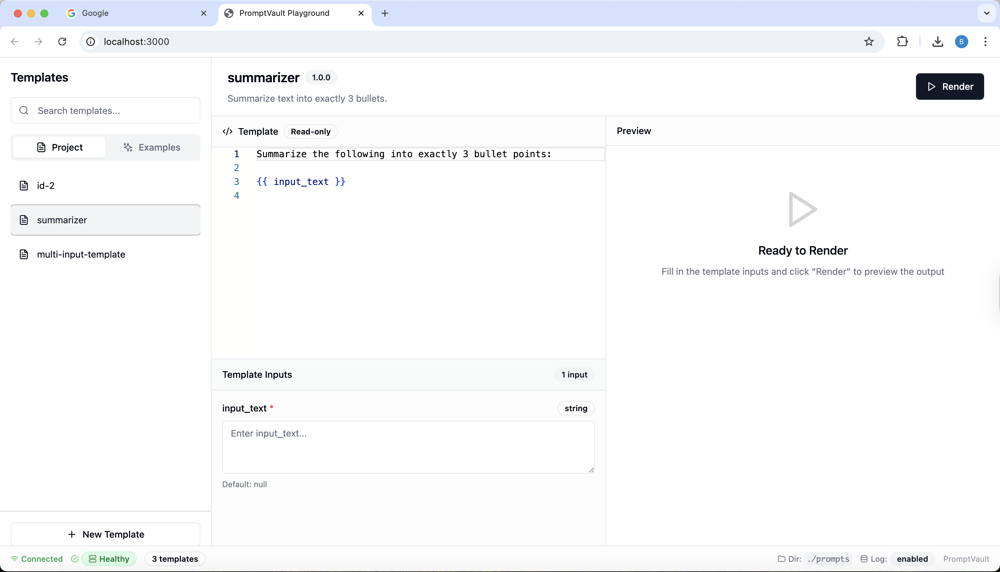

# Dakora

[](https://github.com/bogdan-pistol/dakora/actions)
[](https://codecov.io/gh/bogdan-pistol/dakora)
[](https://www.python.org/downloads/)
[](https://badge.fury.io/py/dakora)
[](https://opensource.org/licenses/Apache-2.0)

A Python library for managing and rendering prompt templates with type-safe inputs, versioning, and an interactive web playground.

## Features

- 🎯 **Interactive Web Playground** - Modern React UI for template development (like Jupyter)
- 🎨 **Type-safe prompt templates** with validation and coercion
- 📁 **File-based template management** with YAML definitions
- 🔄 **Hot-reload support** for development
- 📝 **Jinja2 templating** with custom filters
- 🏷️ **Semantic versioning** for templates
- 📊 **Optional execution logging** to SQLite
- 🖥️ **CLI interface** for template management
- 🧵 **Thread-safe caching** for production use

## Installation

```bash
pip install dakora
```

Or for development:

```bash
git clone https://github.com/bogdan-pistol/dakora.git
cd dakora
uv sync
source .venv/bin/activate
```

## Quick Start

### 1. Initialize a project

```bash
dakora init
```

This creates:
- `dakora.yaml` - Configuration file
- `prompts/` - Directory for template files
- `prompts/summarizer.yaml` - Example template

### 2. Create a template

Create `prompts/greeting.yaml`:

```yaml
id: greeting
version: 1.0.0
description: A personalized greeting template
template: |
  Hello {{ name }}!
  You are {{ age }} years old.
  {{ message | default("Have a great day!") }}
inputs:
  name:
    type: string
    required: true
  age:
    type: number
    required: false
  message:
    type: string
    required: false
    default: "Welcome to Dakora!"
```

### 3. Use in Python

```python
from dakora import Vault

# Initialize vault
vault = Vault("dakora.yaml")

# Get and render template
template = vault.get("greeting")
result = template.render(name="Alice", age=25)
print(result)
# Output:
# Hello Alice!
# You are 25 years old.
# Welcome to Dakora!
```

### 4. Interactive Playground 🎯

Launch the web-based playground (like Jupyter Notebook):

```bash
dakora playground
```


This **automatically**:
- 🔨 Builds the modern React UI
- 🚀 Starts the server at `http://localhost:3000`
- 🌐 Opens your browser to the playground

**Features:**
- ✨ Modern, responsive interface built with shadcn/ui
- 📱 Mobile-friendly design that works on all screen sizes
- 🎨 Real-time template editing and preview
- 🧪 Test templates with different inputs
- 📊 Example templates for inspiration



**Options:**
```bash
dakora playground --port 8080      # Custom port
dakora playground --no-browser     # Don't open browser
dakora playground --no-build       # Skip UI build
```

### 5. CLI Usage


```bash
# List all templates
dakora list

# Get template content
dakora get greeting

# Bump version
dakora bump greeting --minor

# Watch for changes
dakora watch
```


## Template Format

Templates are defined in YAML files with the following structure:


```yaml
id: unique_template_id          # Required: Template identifier
version: 1.0.0                  # Required: Semantic version
description: Template purpose   # Optional: Human-readable description
template: |                     # Required: Jinja2 template string
  Your template content here
  {{ variable_name }}
inputs:                         # Optional: Input specifications
  variable_name:
    type: string                # string|number|boolean|array<string>|object
    required: true              # Default: true
    default: "default value"    # Optional: Default value
metadata:                       # Optional: Custom metadata
  tags: ["tag1", "tag2"]
  author: "Your Name"
```

### Supported Input Types

- `string` - Text values
- `number` - Numeric values (int/float)
- `boolean` - True/false values
- `array<string>` - List of strings
- `object` - Dictionary/JSON object

### Built-in Jinja2 Filters

- `default(value)` - Provide fallback for empty values
- `yaml` - Convert objects to YAML format

## Configuration

`dakora.yaml` structure:

```yaml
registry: local                 # Registry type (currently only 'local')
prompt_dir: ./prompts          # Path to templates directory
logging:                       # Optional: Execution logging
  enabled: true
  backend: sqlite
  db_path: ./dakora.db
```

## Advanced Usage

### FastAPI + OpenAI Integration

Dakora works great with web APIs. Here's a FastAPI example using OpenAI's latest Responses API and GPT-5:

```python
from fastapi import FastAPI
from dakora import Vault
from openai import OpenAI

app = FastAPI()
vault = Vault("dakora.yaml")
client = OpenAI()

@app.post("/chat")
async def chat_endpoint(message: str, template_id: str):
    template = vault.get(template_id)

    # Use template's run method with new Responses API
    result = template.run(
        lambda prompt: client.responses.create(
            model="gpt-5",
            reasoning={"effort": "medium"},
            input=prompt
        ).output_text,
        message=message
    )

    return {"response": result}
```

See [examples/](examples/) for a complete FastAPI application with multiple endpoints, reasoning controls, and error handling.

### With Logging

```python
from dakora import Vault

vault = Vault("dakora.yaml")
template = vault.get("my_template")

# Log execution automatically
result = template.run(
    lambda prompt: call_your_llm(prompt),
    input_text="Hello world"
)
```

### Direct Vault Creation

```python
from dakora import Vault

# Skip config file, use prompt directory directly
vault = Vault(prompt_dir="./my_prompts")
```

### Hot Reload in Development

```python
from dakora import Vault
from dakora.watcher import Watcher

vault = Vault("dakora.yaml")
watcher = Watcher("./prompts", on_change=vault.invalidate_cache)
watcher.start()

# Templates will reload automatically when files change
```

## Development

### Setup

```bash
git clone https://github.com/bogdan-pistol/dakora.git
cd dakora
uv sync
source .venv/bin/activate
```

### Running Tests

```bash
# Run all tests
uv run pytest

# Run with coverage
uv run pytest --cov=dakora

# Run smoke tests
uv run python tests/smoke_test.py
```

### Code Quality

```bash
# Format code
uv run ruff format

# Lint code
uv run ruff check

# Type checking
uv run mypy dakora
```

### Development Commands

See [CLAUDE.md](CLAUDE.md) for detailed development guidance.

## Contributing

1. Fork the repository
2. Create a feature branch: `git checkout -b feature-name`
3. Make your changes and add tests
4. Run the test suite: `uv run pytest`
5. Submit a pull request

## License

This project is licensed under the Apache-2.0 License - see the [LICENSE](LICENSE) file for details.

## Changelog

See [CHANGELOG.md](CHANGELOG.md) for version history.