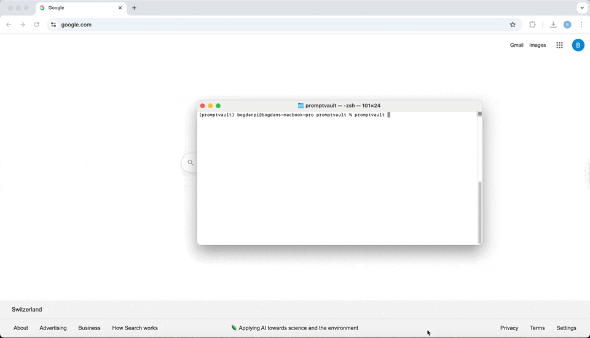
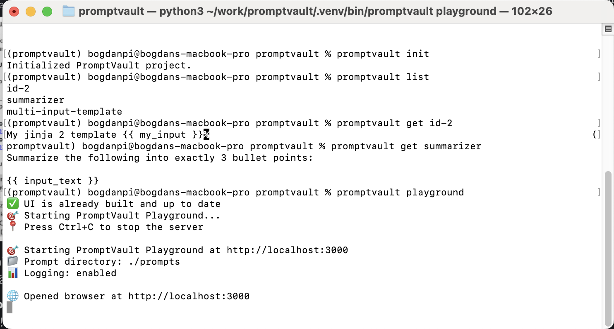
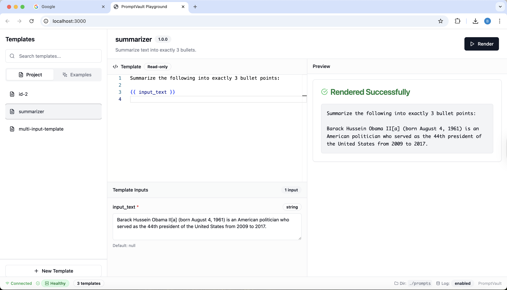

# Dakora

<p align="center">
  
</p>

[](https://github.com/bogdan-pistol/dakora/actions)
[](https://codecov.io/gh/bogdan-pistol/dakora)
[](https://www.python.org/downloads/)
[](https://badge.fury.io/py/dakora)
[](https://opensource.org/licenses/Apache-2.0)
[](https://discord.gg/QSRRcFjzE8)

A Python library for managing and executing LLM prompts with type-safe inputs, versioning, and an interactive web playground. Execute templates against 100+ LLM providers with built-in cost tracking.

## 🚀 Try it Now - No Installation Required!

**[playground.dakora.io](https://playground.dakora.io/)** - Experience Dakora's interactive playground directly in your browser. Edit templates, test inputs, and see instant results with the exact same interface that ships with the Python package.

## Use Case

```python
from dakora import Vault

# Load your templates
vault = Vault("dakora.yaml")

# Execute against any LLM provider
result = vault.get("summarizer").execute(
    model="gpt-4",
    input_text="Your article here..."
)

print(result.output)          # The LLM's response
print(f"${result.cost_usd}")  # Track costs automatically
```

Or from the command line:

```bash
dakora run summarizer --model gpt-4 --input-text "Article..."
```

## Features

- 🌐 **[Live Web Playground](https://playground.dakora.io/)** - Try online without installing anything!
- 🎯 **Local Playground** - Same modern React UI included with pip install
- 🚀 **LLM Execution** - Run templates against 100+ LLM providers (OpenAI, Anthropic, Google, etc.)
- 🎨 **Type-safe prompt templates** with validation and coercion
- 📁 **File-based template management** with YAML definitions
- 🔄 **Hot-reload support** for development
- 📝 **Jinja2 templating** with custom filters
- 🏷️ **Semantic versioning** for templates
- 📊 **Optional execution logging** to SQLite with cost tracking
- 🖥️ **CLI interface** for template management and execution
- 🧵 **Thread-safe caching** for production use
- 💰 **Cost & performance tracking** - Monitor tokens, latency, and costs

## Installation

```bash
pip install dakora
```

**For the interactive playground**:
- PyPI releases include a pre-built UI - just run `dakora playground`
- For development installs (git clone), Node.js 18+ is required
- The UI builds automatically from source on first run if not present

Or for development:

```bash
git clone https://github.com/bogdan-pistol/dakora.git
cd dakora
uv sync
source .venv/bin/activate
```

## Quick Start

### 1. Initialize a project

```bash
dakora init
```

This creates:
- `dakora.yaml` - Configuration file
- `prompts/` - Directory for template files
- `prompts/summarizer.yaml` - Example template

### 2. Create a template

Create `prompts/greeting.yaml`:

```yaml
id: greeting
version: 1.0.0
description: A personalized greeting template
template: |
  Hello {{ name }}!
  You are {{ age }} years old.
  {{ message | default("Have a great day!") }}
inputs:
  name:
    type: string
    required: true
  age:
    type: number
    required: false
  message:
    type: string
    required: false
    default: "Welcome to Dakora!"
```

### 3. Use in Python

```python
from dakora import Vault

# Initialize vault
vault = Vault("dakora.yaml")

# Get and render template
template = vault.get("greeting")
result = template.render(name="Alice", age=25)
print(result)
# Output:
# Hello Alice!
# You are 25 years old.
# Welcome to Dakora!
```

### 4. Interactive Playground 🎯

#### Try Online - No Installation Required!
Visit **[playground.dakora.io](https://playground.dakora.io/)** to experience the playground instantly in your browser with example templates.

#### Or Run Locally
Launch the same web-based playground locally (included with pip install):

```bash
dakora playground
```


This **automatically**:
- 🔨 Builds the modern React UI (first run only)
- 🚀 Starts the server at `http://localhost:3000`
- 🌐 Opens your browser to the playground

**Features:**
- ✨ **Identical experience** online and locally
- 📱 Mobile-friendly design that works on all screen sizes
- 🎨 Real-time template editing and preview
- 🧪 Test templates with different inputs
- 📊 Example templates for inspiration
- 💻 Modern UI built with shadcn/ui components


**Local Options:**
```bash
dakora playground --port 8080      # Custom port
dakora playground --no-browser     # Don't open browser
dakora playground --no-build       # Skip UI build
dakora playground --demo           # Run in demo mode (like the web version)
```

### 5. Execute Templates with LLMs

Dakora can execute templates against real LLM providers (OpenAI, Anthropic, Google, etc.) using the integrated LiteLLM support.

### Setting API Keys
Get an API Key from your LLM provider, you will need an account:
- [Open AI](https://platform.openai.com/docs/libraries#create-and-export-an-api-key) 
- [Anthropic](https://docs.claude.com/en/docs/get-started) 
- [Google](https://ai.google.dev/gemini-api/docs/api-key#api-keys)

Set your API Key as environment variables:

<details>
<summary>Linux/MacOS</summary>

```zsh
export OPENAI_API_KEY="your_key_here"
export ANTHROPIC_API_KEY="your_key_here"
export GOOGLE_API_KEY="your_key_here"
```
</details>

<details>
<summary>Windows</summary>

```bash
setx OPENAI_API_KEY "your_api_key_here"
setx ANTHROPIC_API_KEY=your_key_here
setx GOOGLE_API_KEY=your_key_here
```
</details>

<details>
<summary>Cross-platform</summary>
Alternatively create a .env file in your project root:

```bash
OPENAI_API_KEY="your_key_here"
GOOGLE_API_KEY="your_key_here"
ANTHROPIC_API_KEY="your-api-key-here"
```

Load and use in your Python code:

```
from dotenv import load_dotenv
import os

# Load environment variables from .env file
load_dotenv()

# Access variables using os.environ or os.getenv()
api_key = os.getenv("OPENAI_API_KEY")

#initialise the LLM Client
```

## Warning
Nerver commit your API key to version control.
Add .env to your .gitignore with:
```bash
echo ".env" >> .gitignore
```
</details>

#### Execute from Python

```python
from dakora import Vault

vault = Vault("dakora.yaml")
template = vault.get("summarizer")

# Execute with gpt-4
result = template.execute(
    model="gpt-4",
    input_text="Your article content here..."
)

print(result.output)
print(f"Cost: ${result.cost_usd:.4f}")
print(f"Tokens: {result.tokens_in} → {result.tokens_out}")
```

#### Execute from CLI

```bash
# Basic execution
dakora run summarizer --model gpt-4 --input-text "Article to summarize..."

# With LLM parameters
dakora run summarizer --model gpt-4 \
  --input-text "Article..." \
  --temperature 0.7 \
  --max-tokens 100

# JSON output for scripting
dakora run summarizer --model gpt-4 \
  --input-text "Article..." \
  --json

# Quiet mode (only LLM response)
dakora run summarizer --model gpt-4 \
  --input-text "Article..." \
  --quiet
```

**Example Output:**

```
╭─────────────────────────────────────╮
│ Model: gpt-4 (openai)               │
│ Cost: $0.0045 USD                   │
│ Latency: 1,234 ms                   │
│ Tokens: 150 → 80                    │
╰─────────────────────────────────────╯

The article discusses the recent advances in...
```

#### Supported Models

Dakora supports 100+ LLM providers through LiteLLM:

- **OpenAI:** `gpt-4`, `gpt-4-turbo`, `gpt-5-nano`, `gpt-3.5-turbo`
- **Anthropic:** `claude-3-opus`, `claude-3-sonnet`, `claude-3-haiku`
- **Google:** `gemini-pro`, `gemini-1.5-pro`
- **Local:** `ollama/llama3`, `ollama/mistral`
- **And many more...**

See [LiteLLM docs](https://docs.litellm.ai/docs/providers) for the full list.

### 6. CLI Usage



```bash
# List all templates
dakora list

# Get template content
dakora get greeting

# Execute a template
dakora run summarizer --model gpt-4 --input-text "..."

# Bump version
dakora bump greeting --minor

# Watch for changes
dakora watch

```




### Verify API Keys

Check which API keys are configured:
``` bash
# Check all providers
dakora config

# Check specific provider
dakora config --provider openai
```

## Template Format

Templates are defined in YAML files with the following structure:



```yaml
id: unique_template_id          # Required: Template identifier
version: 1.0.0                  # Required: Semantic version
description: Template purpose   # Optional: Human-readable description
template: |                     # Required: Jinja2 template string
  Your template content here
  {{ variable_name }}
inputs:                         # Optional: Input specifications
  variable_name:
    type: string                # string|number|boolean|array<string>|object
    required: true              # Default: true
    default: "default value"    # Optional: Default value
metadata:                       # Optional: Custom metadata
  tags: ["tag1", "tag2"]
  author: "Your Name"
```

### Supported Input Types

- `string` - Text values
- `number` - Numeric values (int/float)
- `boolean` - True/false values
- `array<string>` - List of strings
- `object` - Dictionary/JSON object

### Built-in Jinja2 Filters

- `default(value)` - Provide fallback for empty values
- `yaml` - Convert objects to YAML format

## Configuration

`dakora.yaml` structure:

```yaml
registry: local                 # Registry type (currently only 'local')
prompt_dir: ./prompts          # Path to templates directory
logging:                       # Optional: Execution logging
  enabled: true
  backend: sqlite
  db_path: ./dakora.db
```

## Advanced Usage

### FastAPI + OpenAI Integration

Dakora works great with web APIs. Here's a FastAPI example using OpenAI's latest Responses API and GPT-5:

```python
from fastapi import FastAPI
from dakora import Vault
from openai import OpenAI

app = FastAPI()
vault = Vault("dakora.yaml")
client = OpenAI()

@app.post("/chat")
async def chat_endpoint(message: str, template_id: str):
    template = vault.get(template_id)

    # Use template's run method with new Responses API
    result = template.run(
        lambda prompt: client.responses.create(
            model="gpt-5",
            reasoning={"effort": "medium"},
            input=prompt
        ).output_text,
        message=message
    )

    return {"response": result}
```

## Examples

### Multi-Agent Research Assistant

**[examples/openai-agents/](examples/openai-agents/)** - Build intelligent research agents with the OpenAI Agents Framework, using Dakora to manage complex multi-agent prompts with type-safe inputs and hot-reload during development.

### FastAPI Integration

See [examples/fastapi/](examples/fastapi/) for a complete FastAPI application with multiple endpoints, reasoning controls, and error handling.

### With Logging

```python
from dakora import Vault

vault = Vault("dakora.yaml")
template = vault.get("my_template")

# Log execution automatically
result = template.run(
    lambda prompt: call_your_llm(prompt),
    input_text="Hello world"
)
```

### Direct Vault Creation

```python
from dakora import Vault

# Skip config file, use prompt directory directly
vault = Vault(prompt_dir="./my_prompts")
```

### Hot Reload in Development

```python
from dakora import Vault
from dakora.watcher import Watcher

vault = Vault("dakora.yaml")
watcher = Watcher("./prompts", on_change=vault.invalidate_cache)
watcher.start()

# Templates will reload automatically when files change
```

## Development

### Setup

```bash
git clone https://github.com/bogdan-pistol/dakora.git
cd dakora
uv sync
source .venv/bin/activate
```

### Running Tests

```bash
# Run all tests
uv run pytest

# Run with coverage
uv run pytest --cov=dakora

# Run smoke tests
uv run python tests/smoke_test.py
```

### Code Quality

```bash
# Format code
uv run ruff format

# Lint code
uv run ruff check

# Type checking
uv run mypy dakora
```

### Development Commands

See [CLAUDE.md](CLAUDE.md) for detailed development guidance.

## Contributing

We welcome contributions! Join our community:

- 💬 **[Discord](https://discord.gg/QSRRcFjzE8)** - Join our Discord server for discussions and support
- 🐛 **Issues** - Report bugs or request features
- 🔀 **Pull Requests** - Submit improvements

### Development Setup

1. Fork the repository
2. Create a feature branch: `git checkout -b feature-name`
3. Make your changes and add tests
4. Run the test suite: `uv run pytest`
5. Submit a pull request

## License

This project is licensed under the Apache-2.0 License - see the [LICENSE](LICENSE) file for details.

## Changelog

See [CHANGELOG.md](CHANGELOG.md) for version history.